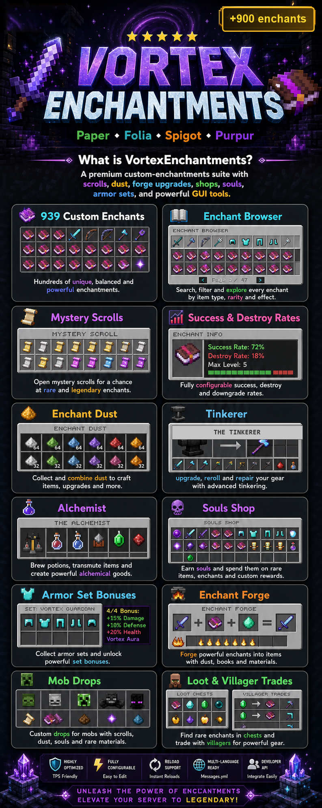

# VortexEnchantments

<p align="center">
  
</p>

<p align="center">
  <strong>939 premium custom enchantments for modern Minecraft servers.</strong>
</p>

<p align="center">
  <a href="https://github.com/Sauron05/VortexEnchantments/wiki">Wiki</a>
  |
  <a href="https://discord.gg/Tya84XrgSF">Support Discord</a>
  |
  <a href="https://eternalrealm.uk">Website</a>
</p>

VortexEnchantments is a premium-style custom enchantments suite for servers that want deeper progression, better loot, polished GUIs, and configurable gameplay systems without turning every feature into a TPS problem.

It ships with scrolls, dust, success and destroy rates, enchant shops, souls, armor sets, combos, evolution, particles, mob drops, villager trades, loot table injection, reloadable configs, permissions, tab completion, and localization-ready messages.

## Highlights

- 939 custom enchantments across weapons, armor, tools, shields, elytra, tridents, rods, hammers, and spears.
- Mystery Scrolls, White Scrolls, Black Scrolls, Holy White Scrolls, Transmog Scrolls, Randomization Scrolls, Extractors, and Slot Increasers.
- Enchant Dust, success rates, destroy rates, rarity tiers, and configurable progression.
- Enchant Browser, Enchant Shop, Souls Shop, Tinkerer, Alchemist, Forge, and Admin GUIs.
- Souls PvP economy, Vault shop pricing, mob drops, loot chest injection, and villager trade injection.
- Armor set bonuses, enchant combos, enchant evolution, aura effects, and per-enchant particles.
- Multi-world controls, permission-based slot limits, configurable messages, and reload support.
- Folia-aware scheduling and server-friendly tick settings.

## Compatibility

| Platform | Support |
| --- | --- |
| Paper | Supported |
| Folia | Supported |
| Spigot | Supported |
| Purpur | Supported |
| Fabric | Supported through a Bukkit compatibility layer such as Cardboard. This repository currently builds one Bukkit/Paper-style plugin jar, not a separate native Fabric mod jar. |

Recommended runtime:

- Java 21+
- Minecraft 1.21.x compatible server
- Optional: Vault, PlaceholderAPI, ProtocolLib

## Quick Install

1. Download the latest VortexEnchantments jar.
2. Stop your server.
3. Place the jar in your `plugins/` folder.
4. Start the server once to generate configuration files.
5. Edit `config.yml`, `messages.yml`, `mob_drops.yml`, and enchant YAML files as needed.
6. Run `/ve reload` or restart after major configuration changes.

For detailed setup, see the [Installation Guide](https://github.com/Sauron05/VortexEnchantments/wiki/Installation).

## Main Command

```text
/ve
```

Aliases:

```text
/vortex
/vortexenchant
```

Common commands:

| Command | Description |
| --- | --- |
| `/ve browse` | Open the enchantment browser. |
| `/ve list [page]` | List loaded enchantments. |
| `/ve info <enchant>` | View details about one enchantment. |
| `/ve search <keyword>` | Search enchantments by name, id, or description. |
| `/ve shop` | Open the Vault economy enchant shop. |
| `/ve souls [shop]` | View souls balance or open the Souls Shop. |
| `/ve tinkerer` | Salvage enchanted items for XP and dust. |
| `/ve alchemist` | Combine books and dust. |
| `/ve forge` | Upgrade enchantments. |
| `/ve aura` | Toggle aura particles. |
| `/ve particles` | Toggle enchant particles. |
| `/ve reload` | Reload plugin configuration. |

Full command documentation is available in the [Commands wiki page](https://github.com/Sauron05/VortexEnchantments/wiki/Commands).

## Permissions

Basic player access starts with:

```text
vortex.use
```

Full admin access:

```text
vortex.admin
```

Most player-facing systems have their own permissions, including browser, shop, tinkerer, alchemist, souls, forge, combos, evolution, particles, and aura access.

See the [Permissions wiki page](https://github.com/Sauron05/VortexEnchantments/wiki/Permissions) for the complete list.

## Configuration

VortexEnchantments is designed to be server-owner friendly. Major systems can be enabled, disabled, priced, weighted, limited, or tuned through YAML files.

Important files:

| File | Purpose |
| --- | --- |
| `config.yml` | Main systems, rates, shops, limits, particles, storage, and integrations. |
| `messages.yml` | Player-facing messages and localization text. |
| `mob_drops.yml` | Mob drop chances and rarity weights. |
| `custom_items.yml` | Custom item definitions and recipes. |
| `enchants/**/*.yml` | Individual enchantment settings. |

See the [Configuration wiki page](https://github.com/Sauron05/VortexEnchantments/wiki/Configuration) for tuning guidance.

## Support

Developer: Sauron

Discord: https://discord.gg/Tya84XrgSF

Website: https://eternalrealm.uk

## License

Distribution and usage terms are controlled by the project owner. Add a `LICENSE` file before public release if this repository will be used as the canonical distribution source.
